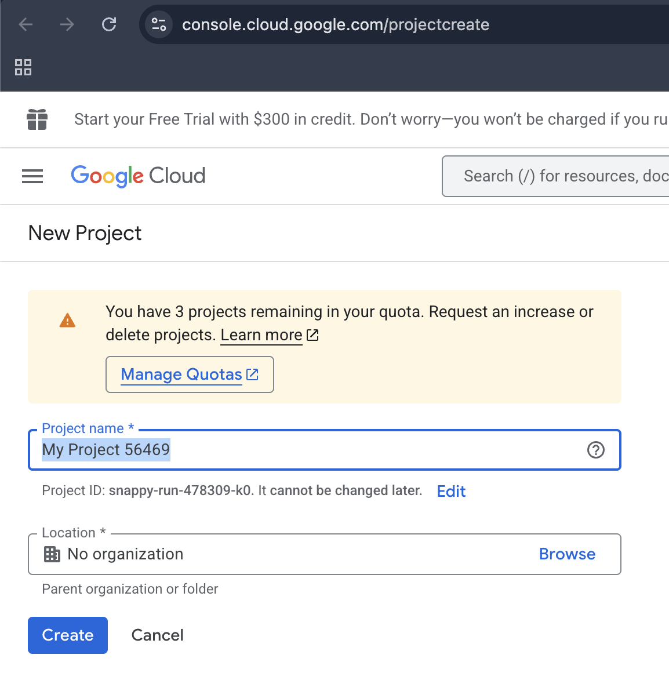
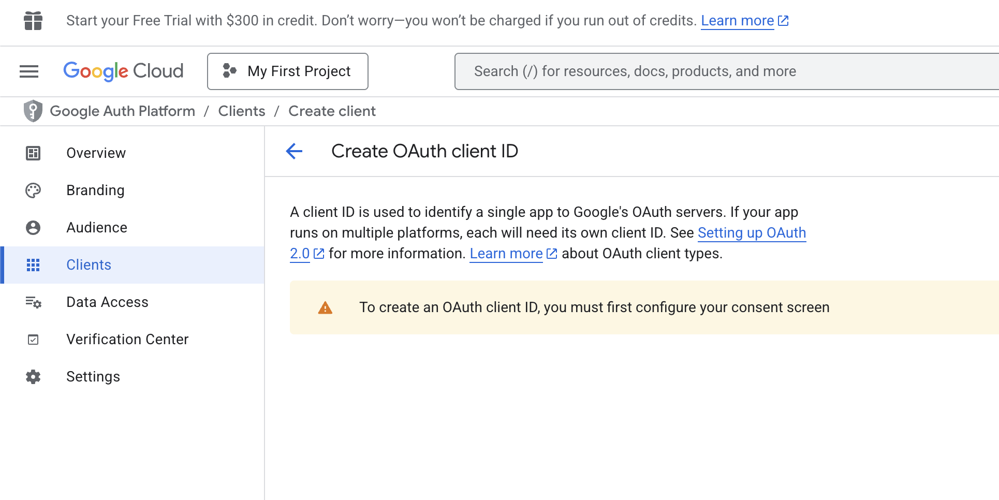
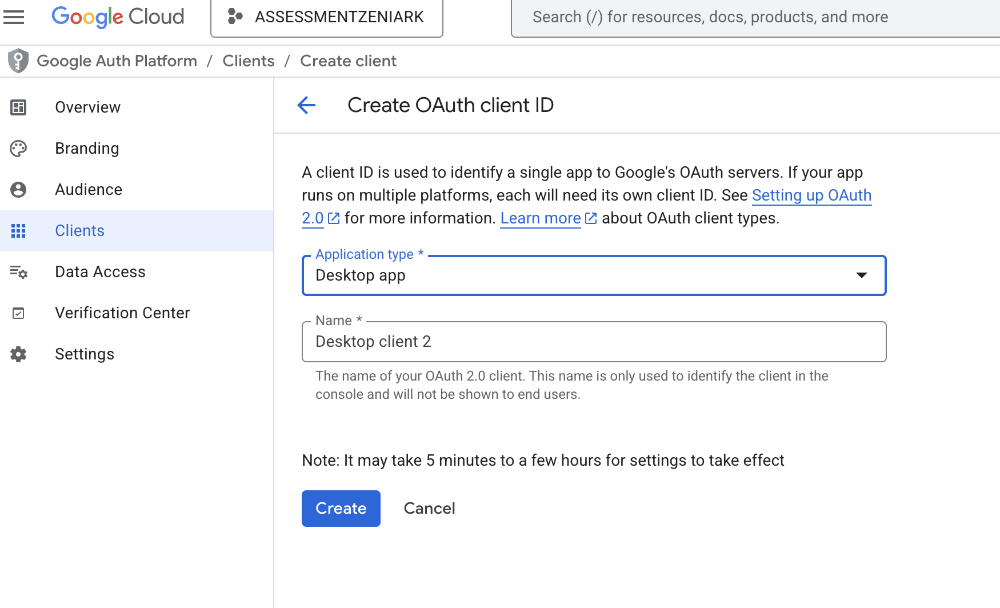

# NOTES API

Notes API assessment zeniark Simple note api with google auth

## Table of contents

- [Prerequisites](#prerequisites)
- [Installation](#installation)
- [SettingUp](#settingup)
- [Usage](#usage)

### Prerequisites

- docker
- npm
- nestjs
- rest client extensions (vscode)
- POSTMAN or BRUNO

## Installation

install npm

- npm

  ```sh
  npm install npm@latest -g
  ```

- npm
  ```sh
  npm install -g @nestjs/cli
  ```

1. Open terminal to Clone the repo

```sh
git clone https://github.com/ian-afk/notes_api.git
```

2. cd or go to the cloned repo

3. Install npm packages for node_modules

```sh
npm install
```

4. Create your env file for google auth this will setup for later

```sh
GOOGLE_CLIENT_ID=sampleclientID
GOOGLE_CLIENT_SECRET=sampleclientsecret
JWT_SECRET=jwtsecret
```

4. Run this command in your cli/terminal

```sh
docker run -d --name dbserver -p 27017:27017 --restart unless-stopped mongo:6.0.4
```

this will install a mongodb server in our docker

## SettingUp

Now that we install all the dependencies we will now fill up our google api credentials

First, we create a project in the Google developer console.

```sh
https://console.cloud.google.com/projectcreate
```



Next go to APIs and Services
After you select APIs... it will redirect you to Overview Then click Clients Then Create Client and follow all the steps


After following the steps and configuration it will lead you to this screen


Fill up all the fields
For audience choose _External_ then so on...

After the said step you can now add your oauth, choose desktop since we're using it in desktop


Fill up all the necessary fields
Then a window will prompt. There we will find the _client id_ and _client secret_ that we need to use in our env file.

After copying the client id and client secret and paste it to env file, we can now use the NOTES API 👌🏻

## USAGE

Now we will run the Notes API

1. Open terminal or open vscode then locate the repo that we clone
2. Now we will start the API

```sh
npm run start
```

There you can now use the api below are the usage of the APIS

## API usage

Heres our API endpoints

- POST http://localhost:3000/notes
- GET http://localhost:3000/notes/:id
- PATCH http://localhost:3000/notes/:id
- DELETE http://localhost:3000/notes/:id

## -- When you logged in the account it response with token that we can use to logged in

- POST http://localhost:3000/auth/signup
- POST http://localhost:3000/auth/login
  for google login we will enter the uri below in google chrome to test the google auth
- http://localhost:3000/auth/google

You can also find the _rest.http_ in the folder for testing the API
